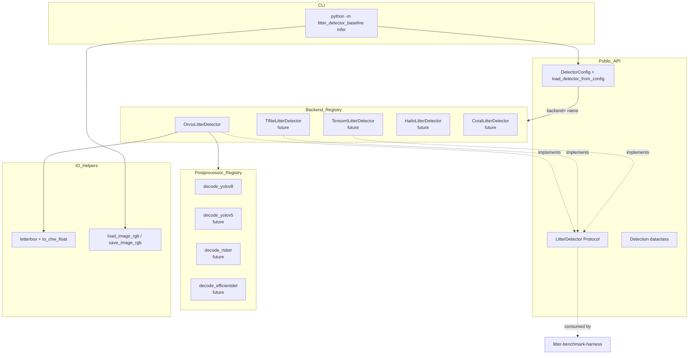
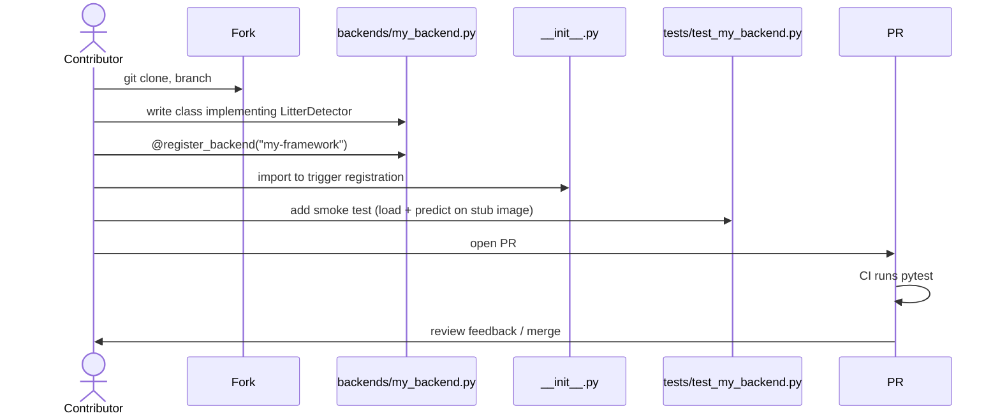
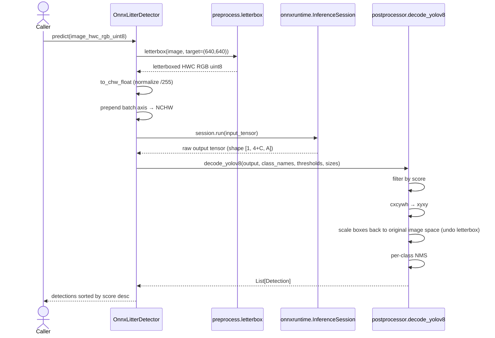

# litter-detector-baseline — Architecture

Status: design review draft, 2026-05-13.

This document describes the proposed architecture of
`litter-detector-baseline` for design review. No code in this doc has
been implemented yet beyond what was sketched in the working branch;
this captures the target state.

Companion document: `litter-benchmark-harness/docs/ARCHITECTURE.md`.

## Purpose

A small, typed Python library that wraps any 2D object detector behind
a uniform interface, so larger systems (robot inference loops, training
pipelines, the companion benchmark harness) can compose against
detection capability without taking a hard dependency on a specific
model architecture or inference framework.

The library is **taxonomy-agnostic**: class names come from a config
file, not from baked-in constants. The "litter" in the name reflects
the reference application (CrustBot's sidewalk-trash robots), not a
hardcoded class space.

## High-level component view



### Component responsibilities

| Component | Responsibility |
|---|---|
| `Detection` (dataclass) | Typed result of one bounding box: class_id, class_name, score, xyxy coordinates in original-image pixel space. |
| `LitterDetector` (Protocol) | Public interface every backend must satisfy. `predict(image) -> Sequence[Detection]`. Lets consumers (benchmark harness, robot inference loop) be agnostic about the underlying framework. |
| `DetectorConfig` (dataclass) | Pure data — YAML-loaded config naming the backend, weights, class names, and thresholds. |
| `load_detector_from_config(path)` | Factory that reads YAML and instantiates the right backend via the registry. |
| Backend implementations | One class per inference framework. ONNX Runtime is the v0.1 reference; TFLite / TensorRT / Hailo / Coral are extension targets. |
| Postprocessors | One function per detector architecture family. Decodes raw output tensors to `List[Detection]`. YOLOv8 decode is the v0.1 reference. |
| Preprocess helpers | Letterbox resize + tensor format conversion. Pure-numpy where possible; opencv where needed for resize quality. |
| I/O helpers | Image load/save. Lazy `cv2` import to keep the package importable in headless contexts. |
| CLI | `python -m litter_detector_baseline infer` — runs config-loaded detector against an image or directory, outputs JSON. |

## Plugin pattern: backend registry

Backends self-register via a module-level decorator:

```python
# inside litter_detector_baseline/backends/onnx_backend.py

from litter_detector_baseline.registry import register_backend

@register_backend("onnxruntime")
class OnnxLitterDetector:
    # ... satisfies LitterDetector protocol
```

The `DetectorConfig.backend` string is the lookup key:

```yaml
# config.yaml
backend: onnxruntime  # ← keys into BACKEND_REGISTRY
weights: model.onnx
class_names: [...]
```

`load_detector_from_config()` reads the config, looks up the backend
class in the registry, and instantiates it with `from_config(config)`.

**Why a registry rather than a big if/elif chain in the loader:**
contributors adding a new backend touch only their backend file plus
import it from `__init__.py`. They never edit the loader. Lower
diff-surface for PRs.

### Adding a new backend (contributor flow)



Backend implementations must:

1. Implement `predict(image, score_threshold, iou_threshold)` returning `Sequence[Detection]`
2. Expose `class_names` and `input_size` properties
3. Accept a `from_config(DetectorConfig)` classmethod for the loader
4. Run on **HWC RGB uint8** numpy input (the public contract)
5. Output boxes in **original-image pixel space** (xyxy)
6. Handle framework absence gracefully (clear ImportError, not obscure crash)

Tests for backend contributions are gated by the presence of the
backend's framework. The CI matrix decides which backends to test
against by inspecting which extras (`pip install '.[tflite]'`,
`'.[tensorrt]'`, etc.) are installed in each job.

## Plugin pattern: postprocessor registry

Detector architectures (YOLOv8, YOLOv5, RT-DETR, EfficientDet) have
different raw output tensor layouts. Postprocessors are separately
pluggable from backends, because the same ONNX backend can run any
of them — only the decode step differs.

```python
# inside litter_detector_baseline/postprocessors/yolov8.py

from litter_detector_baseline.registry import register_postprocessor

@register_postprocessor("yolov8")
def decode_yolov8(output, class_names, score_threshold, iou_threshold,
                  input_size, original_size) -> list[Detection]:
    ...
```

The config names the architecture family:

```yaml
backend: onnxruntime
architecture: yolov8  # ← keys into POSTPROCESSOR_REGISTRY
weights: model.onnx
```

This lets a contributor bring an RT-DETR model and reuse our entire
ONNX backend without rewriting NMS — they only add a new
`postprocessors/rtdetr.py`.

## Inference data flow



### Key design decisions in the data flow

**Letterbox over plain resize.** Aspect-ratio preserving resize with
gray padding. Plain resize distorts boxes and degrades small-object
detection on portrait/landscape mismatches. Letterbox matches what
ultralytics does in training, so accuracy is preserved.

**Per-class NMS.** Global NMS suppresses overlapping boxes of
*different* classes. That's wrong — a wrapper next to a bottle should
both survive. Per-class NMS keeps both.

**Original-image pixel space in the output.** The library's contract
is "boxes you got back are usable against the input image." Consumers
shouldn't have to undo letterbox math themselves.

**Sorted by score descending.** Convention. Downstream consumers
(visualization, top-K filtering) almost always want this order.

## Public API surface

```python
from litter_detector_baseline import (
    Detection,               # dataclass
    LitterDetector,          # protocol
    DetectorConfig,          # config dataclass
    OnnxLitterDetector,      # reference backend
    load_detector_from_config,  # factory
)
```

Internal helpers (`preprocess`, `postprocess`, `io`, `registry`) are
accessible but not exported. Anything in `__init__.py`'s `__all__` is
the stable interface; everything else may change between minor
versions until v1.0.

## Hardware portability

The library is portable across hardware tiers but optimized for the
**Raspberry Pi 5 CPU baseline** as the v0.1 reference platform. The
backend registry is the seam for hardware-specific acceleration.

| Hardware tier | Recommended backend | Status |
|---|---|---|
| Raspberry Pi 5 CPU | `onnxruntime` (CPU EP) | v0.1 reference |
| Pi 5 + AI HAT (Hailo-8) | `hailort` | community contribution welcome |
| Pi 5 + Coral USB Accelerator | `tflite` (EdgeTPU EP) | community contribution welcome |
| Pi 4 / Pi Zero 2W (ARMv7) | `onnxruntime` (CPU EP) | should work; needs benchmark |
| Jetson Orin Nano / Nano | `tensorrt` or `onnxruntime` (CUDA EP) | community contribution welcome |
| Rockchip (RK3566/3588) | `rknn` | community contribution welcome |
| x86 laptop (development) | `onnxruntime` (CPU/CUDA EP) | works out of the box |

The library does not target training. Training pipelines should
produce ONNX (or framework-specific) artifacts that this library then
consumes for inference.

## Configuration philosophy

Configs are YAML. Configs are intentionally small (typically <20
lines) so that someone reading a config can mentally simulate what
will be loaded without running it.

```yaml
backend: onnxruntime
architecture: yolov8
weights: weights/yolov8n_litter_v1_int8.onnx
input_size: [640, 640]
providers: [CPUExecutionProvider]
score_threshold: 0.30
iou_threshold: 0.50
class_names:
  - bottle
  - can
  - wrapper_film
  - cigarette_butt_cluster
  - ...
```

The `class_names` list is the **taxonomy injection point**. Same
library, same backend code, swapped class taxonomy → entirely
different application (litter vs marine debris vs agricultural pests).

## Extension targets (v0.2+)

Not in v0.1, but the architecture supports:

- Mask-output postprocessors (instance segmentation) — would extend
  `Detection` to optionally include a mask.
- Tracking layer (multi-frame box association via SORT/ByteTrack).
  Lives outside `LitterDetector` protocol; consumes its output.
- Live camera capture helper for Pi Camera Module — currently the
  caller's responsibility.
- Model card metadata (license, training-data provenance, intended
  use) bundled with weights.

## Open questions

- **Should the `LitterDetector` protocol expose `predict_batch`?**
  Phase 1 inference is batch=1. Some future backends (CUDA, TensorRT)
  benefit from batching. Proposed: leave it off the protocol, let
  backends expose it as a non-protocol method. Reconsider if a clean
  use case emerges.
- **Should we ship reference weights?** A ~5MB ONNX file in the repo
  vs an optional download step. Proposed: optional download from a
  GitHub release, not committed to the repo. Keeps clone size small.
- **Naming: should this stay `litter-detector-baseline`?** Or rename
  to something domain-agnostic like `edge-detector-baseline`? Proposed:
  keep the litter name. Configs and the reference application are
  litter-specific; the internals are generic, and that's fine. Future
  fork-or-split decision deferred.

## Related repos

- [litter-benchmark-harness](https://github.com/adawgwats/litter-benchmark-harness) — consumes `LitterDetector` protocol to run reproducible benchmarks
- [litter-taxonomy](https://github.com/adawgwats/litter-taxonomy) — class hierarchy reference
- [litter-dataset-spec](https://github.com/adawgwats/litter-dataset-spec) — dataset format spec
